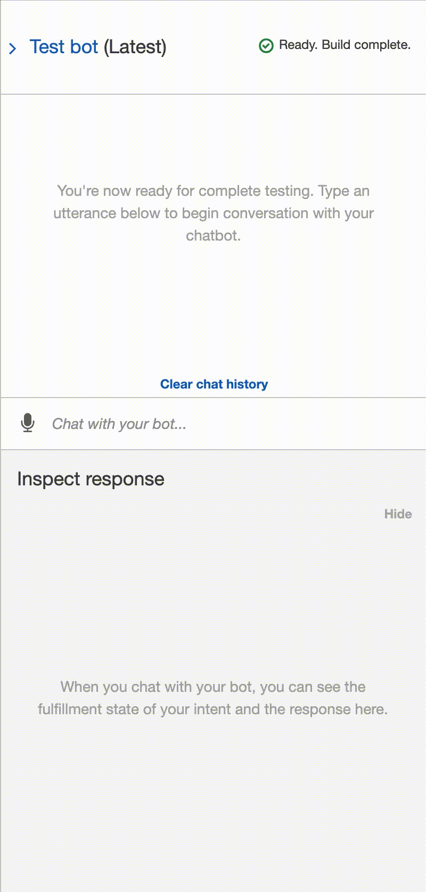

# Robo advisor with AWS Lex

This project creates a robo advisor with AWS Lex and then suggests a portfolio based off of your risk.

---

## Technologies

This project leverages python 3.7.9 with the following packages:

* [AWS Lex](https://aws.amazon.com/lex/) - A service for building conversational interfaces into any application using voice and text.

* [AWS Lambda](https://aws.amazon.com/lambda/) - To build the functionality for the bot.

On the terminal, under the conda dev environment, install the following:

---

## Installation Guide

1. Create AWS free account to access AWS Lambda and AWS Lex.
2. Use VSCODE to view and edit lambda_function.py file.

---

## Examples

Base example before hooked up to AWS Lambda.

Final example after hooked up to AWS Lambda.

---

## Contributors 

Nathan Patterson

Email: nathan.e.patterson@gmail.com

[LinkedIn](https://www.linkedin.com/in/natepatterson/)

---

## License

MIT License
Copyright (c) [2021] [Justine Cho]

Permission is hereby granted, free of charge, to any person obtaining a copy of this software and associated documentation files (the "Software"), to deal in the Software without restriction, including without limitation the rights to use, copy, modify, merge, publish, distribute, sublicense, and/or sell copies of the Software, and to permit persons to whom the Software is furnished to do so, subject to the following conditions:

The above copyright notice and this permission notice shall be included in all copies or substantial portions of the Software.

THE SOFTWARE IS PROVIDED "AS IS", WITHOUT WARRANTY OF ANY KIND, EXPRESS OR IMPLIED, INCLUDING BUT NOT LIMITED TO THE WARRANTIES OF MERCHANTABILITY, FITNESS FOR A PARTICULAR PURPOSE AND NONINFRINGEMENT. IN NO EVENT SHALL THE AUTHORS OR COPYRIGHT HOLDERS BE LIABLE FOR ANY CLAIM, DAMAGES OR OTHER LIABILITY, WHETHER IN AN ACTION OF CONTRACT, TORT OR OTHERWISE, ARISING FROM, OUT OF OR IN CONNECTION WITH THE SOFTWARE OR THE USE OR OTHER DEALINGS IN THE SOFTWARE.
